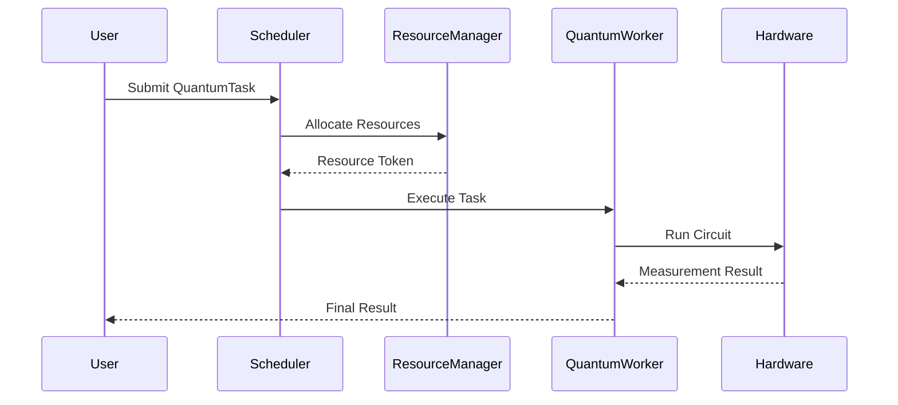

# 🌀 QuantumSim-Framework   

**QuantumSim-Framework is a comprehensive Python-based quantum computing simulation toolkit designed to model, optimize, and visualize quantum algorithms with classical hardware constraints in mind. Built for developers and researchers, it provides a modular architecture for simulating quantum circuits using core gates (Hadamard, CNOT, SWAP, etc.), managing task dependencies via priority queues, and mitigating errors through advanced techniques like Richardson extrapolation. The framework supports real-time visualization of quantum states (Bloch spheres, probability distributions) and circuits, while offering adaptive resource scheduling for parallel task execution. With integrated benchmarking tools, noise modeling, and hardware-aware compilation, it enables users to explore algorithm performance under realistic conditions, test error-correction strategies, and optimize quantum workflows. Ideal for prototyping hybrid quantum-classical algorithms, studying decoherence effects, or teaching quantum computing concepts, QuantumSim-Framework bridges the gap between theoretical quantum mechanics and practical implementation.**


## 🚀 Table of Contents
- [✨ Features](#-features)
- [⚙️ Installation](#-installation)
- [📊 Architecture](#-architecture)
- [🔍 Usage Examples](#-usage-examples)
- [📚 Documentation](#-documentation)
- [🤝 Contributing](#-contributing)
- [📜 License](#-license)

<a name="features"></a>
## ✨ Features
| **Feature**               | **Description**                                                                 | **Icon** |
|---------------------------|---------------------------------------------------------------------------------|----------|
| **Quantum Gates**          | Implement 8+ core quantum gates (H, CNOT, SWAP, etc.)                          | ⚛️       |
| **Task Scheduling**        | Priority-based quantum task queue with dependency management                   | 🎛️       |
| **Error Mitigation**       | Richardson extrapolation and zero-noise extrapolation techniques               | 🛡️       |
| **Visualization**          | Circuit diagrams, Bloch spheres, and probability distributions                 | 📊       |
| **Resource Management**    | Thread-safe quantum resource allocation system                                  | 💻       |
| **Benchmarking**           | Comparative analysis of quantum algorithms                                      | 📈       |

<a name="installation"></a>
## ⚙️ Installation
```bash
# Clone repository
git clone https://github.com/yourusername/QuantumSim-Framework.git
cd QuantumSim-Framework

# Create virtual environment
python -m venv .venv
source .venv/bin/activate  # Linux/Mac
.\.venv\Scripts\activate   # Windows

# Install dependencies
pip install -r requirements.txt
```

<a name="architecture"></a>
## 📊 Architecture


<a name="usage-examples"></a>
## 🔍 Usage Examples

### Grover's Search Algorithm
```python
from quantum import GroverSearch, QuantumTaskFactory

# Create Grover's search task for 3-qubit system
grover_task = QuantumTaskFactory.create_grover_search_task(
    task_id=1,
    complexity=3,
    priority=5,
    n_qubits=3,
    target_state=0b101
)

# Execute and visualize results
result = grover_task.execute()
print(f"Measured state: {bin(result)}")
```

### Circuit Visualization
```python
from quantum import QuantumCircuitVisualizer

# Generate circuit diagram
circuit = QuantumCircuit(2)
circuit.add_gate(QuantumGate.HADAMARD, 0)
circuit.add_gate(QuantumGate.CNOT, 1, 0)
QuantumCircuitVisualizer.draw_circuit(circuit)
```

<a name="documentation"></a>
## 📚 Documentation
| **Component**             | **Description**                                  | **API Reference**           |
|---------------------------|--------------------------------------------------|-----------------------------|
| `QuantumGate`             | Enum of quantum gate operations                  | [Gates Docs](#)             |
| `QuantumState`            | State vector manipulation                       | [State Docs](#)             |
| `QuantumHyperThreading`   | Parallel task execution manager                 | [Threading Docs](#)         |
| `QuantumErrorMitigation`  | Noise simulation and error correction           | [Error Docs](#)             |

<a name="contributing"></a>
## 🤝 Contributing
1. Fork the repository
2. Create your feature branch:  
   `git checkout -b feature/AmazingFeature`
3. Commit changes:  
   `git commit -m 'Add some AmazingFeature'`
4. Push to branch:  
   `git push origin feature/AmazingFeature`
5. Open a Pull Request

<a name="license"></a>
## 📜 License
Distributed under the MIT License. See `LICENSE` for more information.
