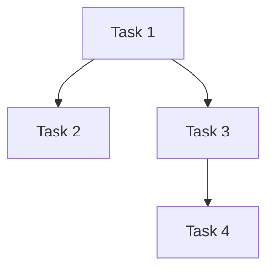

# QuantumSim Framework


## 🚀 Overview
QuantumSim is an advanced quantum computing simulation framework designed for:
- Executing quantum circuits with different gates.
- Simulating quantum algorithms like Grover's search and Quantum Fourier Transform (QFT).
- Managing quantum tasks using multi-threaded scheduling.
- Visualizing quantum states and circuit executions.

---

## 🏗 Features
| Feature | Description |
|---------|-------------|
| 🧮 Quantum Gates | Implements common quantum gates (Hadamard, CNOT, Pauli, etc.) |
| 🔍 Grover's Algorithm | Quantum search algorithm for unstructured databases |
| 🎵 Quantum Fourier Transform | Converts quantum states to the frequency domain |
| ⚡ Multi-Threaded Execution | Parallel task execution with dependency management |
| 📊 Visualization | Plots quantum circuits and state distributions |

---

## 📜 Installation
```bash
pip install -r requirements.txt
```

---

## 📌 Usage
### Initializing a Quantum Circuit
```python
from QuantumSim import QuantumCircuit, QuantumGate

circuit = QuantumCircuit(num_qubits=3)
circuit.add_gate(QuantumGate.HADAMARD, 0)
circuit.add_gate(QuantumGate.CNOT, 1, 0)
circuit.run()
```

### Running Grover's Algorithm
```python
from QuantumSim import GroverSearch

grover = GroverSearch(n_qubits=3, target_state=5)
result = grover.run()
print("Measured state:", result)
```

---

## 📈 Visualization
```python
circuit.visualize()
```


---

## 🌐 Quantum Task Dependencies


---

## 🏆 Performance
- Multi-threaded execution for faster simulation.
- Priority-based scheduling for task optimization.
- Resource-efficient simulation using advanced memory management.

---

## 🛠 Contributing
1. Fork the repository
2. Create a feature branch (`git checkout -b feature-name`)
3. Commit changes (`git commit -m 'Add feature X'`)
4. Push to GitHub (`git push origin feature-name`)
5. Submit a pull request 🚀

---

## 📜 License
MIT License. See `LICENSE` for details.
